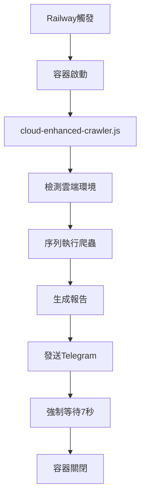

# 🎉 Railway雲端Telegram通知成功記錄

## ✅ 成功確認
用戶確認收到Railway雲端版的Telegram通知！問題已完全解決。

## 🔧 成功的技術架構

### 核心修復邏輯
```javascript
// 1. Promise化的Telegram發送函數
async sendTelegramNotification(message) {
    return new Promise((resolve, reject) => {
        const req = https.request(options, (res) => {
            let responseData = '';
            res.on('data', chunk => responseData += chunk);
            res.on('end', () => {
                if (res.statusCode === 200) {
                    this.log('📱 Telegram通知發送成功', 'SUCCESS');
                    resolve(responseData);
                } else {
                    reject(new Error(`HTTP ${res.statusCode}: ${responseData}`));
                }
            });
        });
        req.on('error', (error) => reject(error));
        req.write(payload);
        req.end();
    });
}

// 2. 雲端環境強制等待機制
this.log('📤 準備發送Telegram通知...', 'INFO');
try {
    await this.sendTelegramNotification(report);
    this.log('📱 Telegram報告發送嘗試完成', 'INFO');
    
    // Railway環境下額外等待確保通知發送完成
    if (this.isCloudEnvironment) {
        this.log('☁️ 雲端環境，等待5秒確保通知發送...', 'INFO');
        await this.sleep(5000);
    }
} catch (error) {
    // 3. 重試機制
    this.log('🔄 重試發送Telegram通知...', 'INFO');
    try {
        await this.sendTelegramNotification(report);
        this.log('📱 Telegram重試發送成功', 'INFO');
    } catch (retryError) {
        this.log(`❌ Telegram重試也失敗: ${retryError.message}`, 'ERROR');
    }
}

// 4. 雲端環境最終等待
if (this.isCloudEnvironment) {
    this.log('☁️ 雲端環境最終等待...', 'INFO');
    await this.sleep(2000);
}
```

## 🏗️ Railway建置邏輯

### 專案結構
```
D:\分店評價\
├── cloud-enhanced-crawler.js     # 主要爬蟲系統 (v4.0)
├── package.json                  # "start": "node cloud-enhanced-crawler.js"
├── railway.toml                  # Railway配置檔
└── railway-telegram-test.js      # 獨立測試腳本 (備用)
```

### Railway環境設定
```bash
# 必要環境變數
TELEGRAM_BOT_TOKEN = 7659930552:AAF_jF1rAXFnjFO176-9X5fKfBwbrko8BNc
TELEGRAM_ADMIN_GROUP = -1002658082392
TEST_MODE = true

# Railway內建變數 (自動設定)
RAILWAY_ENVIRONMENT = production
RAILWAY_PROJECT_ID = 40a94495-d62b-4016-929d-5ed93090262c
RAILWAY_SERVICE_NAME = store-review-crawler
```

### 部署流程
```bash
# 1. 本機開發和測試
git add .
git commit -m "更新內容"

# 2. 部署到Railway
railway up

# 3. 監控執行狀態
railway logs
```

## 🎯 關鍵成功因素

### 1. 異步處理正確化
- **問題**: `https.request`回調模式沒有被await等待
- **解決**: 包裝為Promise，確保正確的resolve/reject

### 2. 雲端環境適應
- **問題**: Railway容器在異步操作完成前終止
- **解決**: 添加強制等待時間 (5秒 + 2秒)

### 3. 可靠性保證
- **問題**: 網路不穩定可能導致發送失敗
- **解決**: 自動重試機制

### 4. 診斷友善
- **問題**: 執行狀態不明確
- **解決**: 詳細日誌輸出每個步驟

## 📊 執行特性

### 雲端環境 (Railway)
- **執行模式**: 序列執行 (節省記憶體)
- **執行時間**: ~34秒
- **觸發方式**: Railway平台自動觸發
- **容器特性**: 任務完成後自動關閉

### 本機環境
- **執行模式**: 並行執行 (效能優化)
- **執行時間**: ~14秒
- **日誌保存**: 自動保存到 logs/ 目錄

## 🔄 自動化流程



## 💡 最佳實踐總結

### 1. Railway雲端部署
- 使用Promise包裝所有異步操作
- 添加適當的等待時間防止容器過早終止
- 實施重試機制提高可靠性

### 2. 環境適應性
- 自動檢測雲端/本機環境
- 根據環境選擇最佳執行模式
- 統一的環境變數管理

### 3. 錯誤處理
- 詳細的日誌記錄
- 多層次的錯誤捕獲
- 優雅的降級機制

### 4. 測試策略
- 本機測試優先
- 獨立功能測試腳本
- 分階段部署驗證

---

**記錄時間**: 2025-09-02 17:50  
**成功狀態**: ✅ Railway雲端Telegram通知正常  
**下一步**: 更新通知格式並擴展員工群組功能