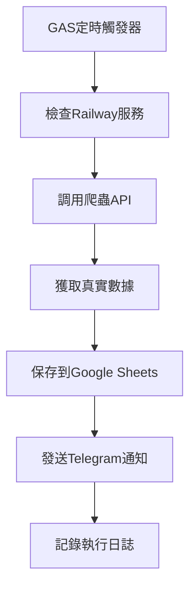

# 🚀 Google Apps Script 混合架構方案

## 📋 方案概述

**架構：**
- **Google Apps Script**（免費）：定時觸發、Telegram通知、數據存儲
- **Railway部署服務**（$5/月）：真實數據爬蟲

**成本：**
- GAS: 完全免費
- Railway: $5/月
- 總成本: $5/月（比純VPS方案便宜且更穩定）

## 🛠️ 部署步驟

### 第一步：部署爬蟲服務（Railway）

1. **前往Railway**: https://railway.app
2. **部署項目**：
   - 選擇GitHub倉庫 `restaurant-review-system`
   - 自動部署（包含Docker配置）
   - 設定環境變數
3. **獲取API網址**：例如 `https://restaurant-review-system-production.up.railway.app`

### 第二步：設定Google Apps Script

1. **創建新的GAS項目**：
   - 前往 https://script.google.com
   - 點擊「新專案」
   - 將 `restaurant-checker.gs` 代碼複製進去

2. **配置常量**：
   ```javascript
   const CONFIG = {
     TELEGRAM_BOT_TOKEN: '您的Bot Token',
     TELEGRAM_CHAT_IDS: ['您的群組ID'],
     CRAWLER_API_URL: 'https://您的railway網址',
     SPREADSHEET_ID: '您的Google Sheets ID'（可選）
   };
   ```

3. **設定權限**：
   - 授權GAS存取Google Sheets
   - 授權GAS發送HTTP請求

### 第三步：設定定時觸發器

```javascript
// 在GAS編輯器中執行一次
function setupTrigger() {
  // 自動設定每天凌晨1點執行
}
```

### 第四步：測試系統

```javascript
// 手動執行測試
function testRun() {
  // 立即執行一次查詢
}
```

## 📊 功能特色

### ✅ 完整功能覆蓋

1. **真實數據抓取**：
   - Google Maps真實評分
   - UberEats真實資訊  
   - Foodpanda真實數據

2. **自動化執行**：
   - 每天凌晨1點自動查詢
   - 無需人工干預
   - 錯誤自動通知

3. **多重通知**：
   - Telegram群組通知
   - 支援多個群組
   - 錯誤狀況通知

4. **數據存儲**：
   - Google Sheets自動記錄
   - 歷史數據查詢
   - 趨勢分析

### 💰 成本優勢

| 方案 | 成本 | 功能完整度 | 維護難度 |
|------|------|------------|----------|
| **GAS混合方案** | $5/月 | 100% | 低 |
| 純Railway/VPS | $5-10/月 | 100% | 中 |
| 純GAS+API | $0-20/月 | 60% | 低 |
| Vercel | $0 | 20% | 高 |

## 🔧 配置說明

### Telegram設定
```javascript
TELEGRAM_BOT_TOKEN: '7659930552:AAF_jF1rAXFnjFO176-9X5fKfBwbrko8BNc'
TELEGRAM_CHAT_IDS: ['-1002658082392'] // 支援多群組
```

### 餐廳配置
```javascript
RESTAURANTS: [
  {
    name: '中壢龍崗',
    urls: {
      google: 'Google Maps URL',
      uber: 'UberEats URL', 
      panda: 'Foodpanda URL'
    },
    enabled: true
  }
  // 可添加多間餐廳
]
```

### Google Sheets整合（可選）
```javascript
SPREADSHEET_ID: 'your_sheet_id' // 自動記錄查詢歷史
```

## 📈 執行流程



## 🛡️ 錯誤處理

1. **爬蟲服務離線**：
   - 自動檢測服務狀態
   - 發送錯誤通知
   - 等待服務恢復

2. **數據抓取失敗**：
   - 重試機制
   - 部分失敗通知
   - 歷史數據對比

3. **通知發送失敗**：
   - 多群組備援
   - 錯誤日誌記錄
   - 手動重試功能

## 🎯 監控和維護

### 日常監控
- 每日Telegram通知確認
- Google Sheets數據檢查
- Railway服務狀態監控

### 維護任務
- 月度：檢查GAS執行配額
- 季度：更新爬蟲規則
- 年度：評估成本和效果

## 🚀 擴展功能

### 可選增強
1. **多餐廳支援**：輕鬆添加新餐廳
2. **多平台通知**：Email、Line等
3. **數據分析**：評分趨勢圖表
4. **警報系統**：評分下降警告

## 📞 技術支援

### 常見問題
1. **GAS執行超時**：優化請求頻率
2. **Railway服務重啟**：等待自動恢復
3. **Google Sheets權限**：重新授權

### 聯繫方式
- 檢查Railway部署日誌
- 查看GAS執行記錄
- Telegram群組技術討論

---

## 🎉 總結

這個混合架構方案結合了：
- **GAS的免費穩定**
- **Railway的強大功能**
- **完整的自動化流程**
- **極低的維護成本**

是目前最平衡且實用的解決方案！